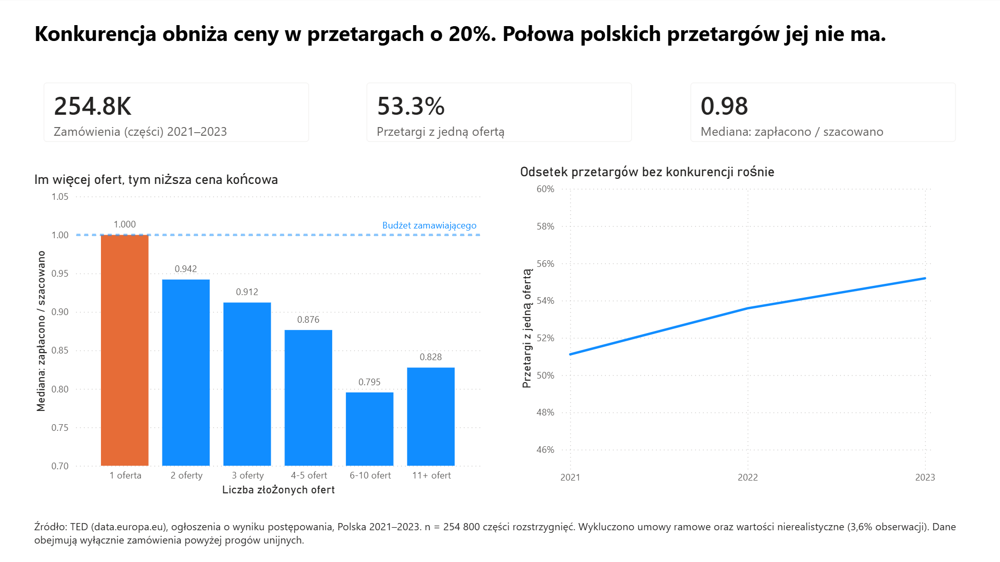

# Czy konkurencja oszczędza publiczne pieniądze?

Analiza polskich zamówień publicznych 2021–2023 · Alteryx → PostgreSQL → Power BI

---

## O projekcie

Instytucje publiczne nie mogą po prostu czegoś kupić za publiczne pieniądze — muszą ogłosić przetarg, firmy składają oferty, wygrywa jedna. Sprawdzam, czy większa konkurencja realnie oszczędza publiczne pieniądze: czy tam, gdzie ofert było więcej, instytucja zapłaciła mniej.

Nie porównuję samych kwot, bo zamówienia są nieporównywalne — porównuję stosunek kwoty zapłaconej do wartości szacowanej przed przetargiem. Analiza obejmuje 580 tysięcy części rozstrzygnięć (108 tysięcy ogłoszeń o wyniku) z Polski, z lat 2021–2023, pobranych z unijnego rejestru TED.

---

## Wynik główny

> **Przy jednym oferencie zamawiający płaci dokładnie tyle, ile założył w budżecie. Przy sześciu do dziesięciu — o 20% mniej. A ponad połowa polskich przetargów ma jednego oferenta.**



### Konkurencja obniża cenę

Mediana stosunku ceny wybranej oferty do wartości szacowanej, według liczby złożonych ofert (`awards_final`, n = 254 800):

| Liczba ofert | Zamówień | Mediana | P25 | P75 |
|---|---:|---:|---:|---:|
| 1 oferta | 135 806 | **1,000** | 0,916 | 1,058 |
| 2 oferty | 50 448 | 0,942 | 0,771 | 1,041 |
| 3 oferty | 29 676 | 0,912 | 0,726 | 1,024 |
| 4–5 ofert | 26 907 | 0,876 | 0,676 | 1,012 |
| 6–10 ofert | 9 911 | **0,795** | 0,593 | 0,972 |
| 11+ ofert | 2 052 | 0,828 | 0,604 | 0,994 |

Zależność jest wyraźna i monotoniczna do przedziału 6–10 ofert. Wartość 1,000 przy jednym oferencie oznacza, że zamawiający wydaje zaplanowany budżet co do grosza — brak konkurencji to brak presji cenowej. Różnica między przetargiem jednoofertowym a takim z 6–10 ofertami wynosi ok. 20 punktów procentowych wartości szacowanej.

**Odchylenie w ostatnim wierszu.** Grupa 11+ ofert ma medianę wyższą (0,828) niż grupa 6–10 (0,795), więc trend nie jest monotoniczny na samym końcu. Dwa wyjaśnienia, oba niezweryfikowane:

1. Liczebność grupy (2 052 wobec 135 806 w grupie odniesienia) — wahnięcie mieści się w zakresie szumu.
2. Wysycenie efektu — zamówienia przyciągające kilkanaście ofert to zwykle proste, standardowe zakupy o niskich marżach, gdzie nie ma już czego ścinać.

Wniosek ostrożny: **efekt konkurencji jest silny do ok. 10 ofert, powyżej tego progu się wypłaszcza.**

### Konkurencji w większości przetargów nie ma

Udział postępowań jednoofertowych rośnie, a średnia liczba ofert spada.

Tryb `OPE` (przetarg nieograniczony), dane przed odcięciem wartości błędnych:

| Rok | Średnia liczba ofert | Udział części z jedną ofertą |
|---|---:|---:|
| 2021 | 2,30 | 49,7% |
| 2022 | 2,20 | 51,7% |
| 2023 | 2,14 | **53,9%** |

Na tabeli analitycznej `awards_final` (po odcięciu wartości błędnych) wartości są nieco wyższe — to one są prezentowane w raporcie Power BI.

Przetarg z jedną ofertą jest formalnie ważny, ale nie zawiera elementu konkurencji: zamawiający nie ma alternatywy wobec złożonej propozycji.

Trzy punkty w czasie to za mało, by mówić o trendzie w sensie statystycznym — opisuję to jako wzrost w latach 2021–2023.

### Walidacja zewnętrzna

Wynik dla 2021 r. (49,7%) jest zgodny z danymi Komisji Europejskiej: według Single Market Scoreboard udział ofert jednoosobowych w Polsce na koniec 2021 r. przekroczył 50%, plasując Polskę wśród państw o najwyższym wskaźniku w UE. Próg alarmowy przyjęty w Scoreboardzie wynosi 20%.

Metodologie nie są tożsame (Scoreboard stosuje własne filtry i jednostkę obserwacji), więc zgodność co do dziesiątych części procenta nie była oczekiwana. Zgodność rzędu wielkości i kierunku wniosku potwierdza poprawność przetwarzania danych.

- [Single Market and Competitiveness Scoreboard — Access to public procurement](https://single-market-scoreboard.ec.europa.eu/business-framework-conditions/public-procurement_en)
- [Europejski Trybunał Obrachunkowy, Sprawozdanie specjalne 28/2023](https://www.eca.europa.eu/ECAPublications/SR-2023-28/SR-2023-28_EN.pdf)

### Zastrzeżenia do powyższych liczb

- Jednostką obserwacji jest **część rozstrzygnięcia**, nie postępowanie. Ogłoszenie podzielone na 15 części waży 15 razy więcej niż jednoczęściowe.
- Wskaźniki konkurencji liczone są dla trybu `OPE` (96% wierszy) i wyłącznie dla wierszy z wypełnionym polem `number_offers` (~75%).
- Dane obejmują wyłącznie zamówienia powyżej progów unijnych.

---

## Pytanie badawcze i miara

> Czy większa liczba złożonych ofert obniża stosunek ceny wybranej oferty do wartości szacowanej?

```
savings_ratio = award_value_euro / award_est_value_euro
```

Wartość poniżej 1 oznacza, że instytucja zapłaciła mniej, niż planowała. Wskaźnik jest znormalizowany, więc pozwala porównać zamówienie za 50 tys. EUR z zamówieniem za 50 mln EUR — a to konieczne, bo dane nie zawierają ilości ani jednostek, więc ceny jednostkowej policzyć się nie da.

## Architektura

```
TED (CSV, 3 pliki roczne)
   ↓  Alteryx Designer — odczyt po masce, filtr kraju, ujednolicenie nazw pól
PostgreSQL — warstwa surowa (raw_notices)
   ↓  SQL — warstwa czysta (clean_awards), tabela analityczna (awards_final)
PostgreSQL — warstwa analityczna
   ↓
Power BI — raport
```

Podział ról: Alteryx odpowiada za pozyskanie i wierne załadowanie danych, SQL za wszystkie przekształcenia analityczne, Power BI wyłącznie za prezentację.

## Dane

**Źródło:** [TED (csv subset) — data.europa.eu](https://data.europa.eu/data/datasets/ted-csv), wydawca: Komisja Europejska, DG GROW
**Typ:** contract award notices (ogłoszenia o wyniku postępowania)
**Zakres:** Polska (`ISO_COUNTRY_CODE = 'PL'`), lata 2021–2023
**Struktura źródła:** 75 kolumn, identyczny schemat we wszystkich trzech plikach rocznych

| Rok | Wierszy | Ogłoszeń (distinct) | Części na ogłoszenie |
|---|---:|---:|---:|
| 2021 | 176 435 | 30 482 | 5,79 |
| 2022 | 194 331 | 37 580 | 5,17 |
| 2023 | 210 038 | 40 579 | 5,18 |
| **Razem** | **580 804** | **108 641** | — |

### Przepływ obserwacji

| Etap | Wierszy |
|---|---:|
| `raw_notices` — surowe dane, Polska 2021–2023 | 580 804 |
| `clean_awards` — komplet kluczowych pól, bez umów ramowych | 264 223 |
| `awards_final` — po odcięciu wartości błędnych | **254 800** |

Do analizy trafia 43,9% wierszy źródłowych. Główną przyczyną ubytku nie jest brak liczby ofert, lecz brak wartości szacowanej — pole to jest puste w ok. 39% wierszy poza tym kompletnych.

---

## Ustalenia z rozpoznania danych

**1. Granulacja: jeden wiersz to jedna część rozstrzygnięcia, nie jedno postępowanie.**
Ogłoszenie podzielone na 15 części daje 15 wierszy z tym samym `id_notice_can`. Liczenie postępowań przez `COUNT(*)` zawyża wynik ok. 5-krotnie.

**2. Wzrost liczby ogłoszeń jest realny, nie wynika z fragmentacji.**
Liczba ogłoszeń wzrosła o 33% (30 482 → 40 579), liczba wierszy tylko o 19%. Liczba części na ogłoszenie spadła z 5,79 do 5,18.

**3. Pułapka wartości.**
`value_euro` opisuje całe ogłoszenie (przy umowach ramowych — pułap na lata), `award_value_euro` faktycznie udzieloną część. W przykładowym wierszu różnica wynosiła 15×. Analiza opiera się wyłącznie na `award_value_euro`.

**4. Kompletność kluczowych pól: 74–76%, stabilna między latami.**

| Rok | Wszystkie | Z `number_offers` i `award_value_euro` | % |
|---|---:|---:|---:|
| 2021 | 176 435 | 132 588 | 75,2 |
| 2022 | 194 331 | 143 475 | 73,8 |
| 2023 | 210 038 | 159 624 | 76,0 |

**5. Braki nie dają się wyjaśnić trybem postępowania.**
Hipoteza robocza zakładała, że brakujące `number_offers` koncentrują się w trybach niekonkurencyjnych. Dane ją obaliły — kompletność jest tam wyższa niż w trybie otwartym.

| Tryb | Wierszy | Kompletność |
|---|---:|---:|
| OPE (przetarg nieograniczony) | 556 983 | 74,9% |
| NOC (bez ogłoszenia) | 10 555 | 78,1% |
| AWP (bez uprzedniej publikacji) | 5 779 | 90,7% |
| RES (ograniczony) | 4 836 | 82,8% |
| pozostałe | 2 651 | 33–82% |

Prawdopodobne wyjaśnienie: w trybach jednoofertowych pole jest trywialne do wypełnienia („1"), a w dużych postępowaniach wieloczęściowych bywa pomijane. Hipoteza niezweryfikowana.

**6. Kolumna `cancelled` jest bezużyteczna.**
Wszystkie 580 804 wiersze mają wartość `0` — TED nie publikuje w tym eksporcie postępowań anulowanych. Filtr po tej kolumnie byłby martwym kodem.

**7. Wartości skrajne wskaźnika to wartości zastępcze, nie zjawisko ekonomiczne.**

Rozkład `savings_ratio` na 264 223 wierszach:

| min | p01 | p25 | mediana | p75 | p99 | max | średnia |
|---:|---:|---:|---:|---:|---:|---:|---:|
| 0,000 | 0,079 | 0,810 | **0,978** | 1,046 | 2,356 | 4 080 000 | **33,961** |

Mediana 0,978, średnia 33,961 — ta sama kolumna. Średnia jest zniszczona przez wartości skrajne i nie nadaje się do raportowania. **Decyzja metodologiczna: w całej analizie stosowana jest mediana.**

Przegląd wierszy skrajnych ujawnił przyczynę:

| Zamawiający | Wart. szacowana | Zapłacono | Wskaźnik |
|---|---:|---:|---:|
| Śląskie Centrum Chorób Serca w Zabrzu | 1,00 EUR | 4 080 000 EUR | 4 080 000 |
| Gmina Syców | 0,22 EUR | 236 791 EUR | 1 076 324 |

Wartość **0,22 EUR** powtarza się w wielu wierszach. Przy kursie ok. 4,5 PLN/EUR odpowiada to kwocie **1 PLN** — tej samej wartości zastępczej wpisanej w złotówkach i przeliczonej przez TED na euro.

## Decyzje projektowe

| Decyzja | Uzasadnienie |
|---|---|
| Warstwa surowa ładowana w całości (75 kolumn) | staging ma być wierną kopią źródła; selekcja kolumn to decyzja analityczna i należy do warstwy czystej |
| Wszystkie pola ładowane jako tekst | uniknięcie cichych błędów konwersji przy ładowaniu; typy nadawane jawnie w SQL |
| Odczyt po masce `export_CAN_*.csv` zamiast Batch Macro | schematy trzech plików rocznych okazały się identyczne — makro byłoby nieuzasadnioną komplikacją |
| Nazwy kolumn sprowadzone do małych liter | PostgreSQL składa niecytowane identyfikatory do lowercase; mieszanie wielkości liter wymusza cytowanie w każdym zapytaniu |
| Umowy ramowe (`b_fra_agreement = 'Y'`) wykluczone | ich kwota to pułap wieloletni, nie faktyczny zakup; 1,1% wierszy |
| Wiersze z pustym `top_type` wykluczone | 122 wiersze o kompletności 33% — dane wybrakowane |
| Mediana zamiast średniej | rozkład wskaźnika ma ciężki ogon; średnia różni się od mediany 35-krotnie |
| Grupowanie liczby ofert liczone w SQL, nie w DAX | przekształcenia trzymane blisko źródła są widoczne w kodzie i wspólne dla wszystkich odbiorców |
| Kodowanie UTF-8, długość pola 2000 | zachowanie polskich znaków i pełnej treści pola `title` |

### Reguła odcięcia wartości błędnych

Z `clean_awards` (264 223 wiersze) usunięto wiersze spełniające którykolwiek warunek:

| Warunek | Wierszy |
|---|---:|
| `est_value_eur < 100` — wartość nierealistyczna dla zamówienia powyżej progów UE | 4 924 |
| `savings_ratio` poza przedziałem [0,1 ; 3] | 4 729 |
| `n_offers < 1` — zamówienie udzielone przy zerowej liczbie ofert | 2 |
| **Łącznie odrzucono (warunki się nakładają)** | **9 423 (3,57%)** |

Reguła jest jawna i oparta na przesłance merytorycznej (wartości niemożliwe), a nie na dopasowaniu do oczekiwanego wyniku.

## Ograniczenia

1. **Tylko zamówienia powyżej progów unijnych.** TED nie obejmuje małych przetargów. Wnioski dotyczą dużych zamówień, nie całego rynku.
2. **Zbiór CSV kończy się na 31.12.2023.** Dane nie są bieżące.
3. **Do analizy trafia 43,9% wierszy źródłowych.** Przyczyna braków pozostaje niewyjaśniona, więc nie można wykluczyć obciążenia próby.
4. **Brak ilości i jednostek.** Dane zawierają wyłącznie kwoty, więc nie da się policzyć ceny jednostkowej ani porównać ceny „tego samego produktu".
5. **Wartość szacowana jest deklaracją zamawiającego**, nie obiektywną wyceną rynkową. Instytucja może ją zawyżać lub zaniżać, co wpływa na interpretację wskaźnika.
6. **Analiza pokazuje współwystępowanie, nie przyczynowość.** Możliwe, że to nie konkurencja obniża cenę, lecz zamówienia proste i atrakcyjne przyciągają zarazem więcej ofert i niższe wyceny.

## Środowisko i problemy techniczne

**Stack:** Alteryx Designer (64-bit) · PostgreSQL 18 · psqlODBC · Power BI

**Problem 1 — sterownik ODBC.** psqlODBC w wersji 18 powoduje w Alteryksie błąd `Unexpected error while parsing ODBC column description types`. Alteryx nie rozpoznaje sterownika jako natywnie wspieranego (`There is no Lua script, using generic ODBC`) i wykłada się na opisie typów kolumn, mimo że dane częściowo przechodzą.

Rozwiązanie: cofnięcie sterownika do gałęzi 16. Protokół PostgreSQL jest wstecznie kompatybilny, więc starszy sterownik obsługuje serwer w wersji 18 bez zmian po stronie bazy. Wniosek: najnowsza wersja sterownika nie jest wersją właściwą — narzędzia BI mają własne listy wspieranych wersji.

**Problem 2 — kodowanie.** Pierwsze ładowanie odczytało plik w Latin-1 zamiast UTF-8, przez co polskie znaki w nazwach zamawiających uległy zniekształceniu („ÅšlÄ…skie" zamiast „Śląskie"). Ponieważ nazwa zamawiającego jest jedną z osi analizy, dane nie nadawały się do użycia.

Naprawa: zmiana Code Page w Alteryx na UTF-8 i ponowne uruchomienie workflow — pół miliona rekordów wróciło poprawione bez ręcznej ingerencji. Warstwa czysta wymagała odbudowania, ponieważ jest fizyczną kopią, a nie widokiem.

Wniosek procesowy: powtarzalny pipeline sprowadza taką korektę do zmiany jednego ustawienia; przy czyszczeniu ręcznym oznaczałaby pracę od zera. Skrypty SQL utrzymywane są jako idempotentne (`DROP TABLE IF EXISTS`), by dały się uruchamiać wielokrotnie bez efektów ubocznych.

**Połączenie:** przez Alteryx DCM (Data Connection Manager) z rozdzieleniem definicji źródła (`pg_procurement_ds`) i poświadczeń (`pg_local`), zamiast osadzania hasła w workflow.

## Jak odtworzyć

1. Pobrać z TED pliki `contract award notices` za lata 2021, 2022, 2023 i rozpakować do jednego folderu.
2. Utworzyć bazę `procurement` w PostgreSQL, skonfigurować DSN ODBC (psqlODBC 16, wariant Unicode).
3. Uruchomić `alteryx/01_load_ted_to_postgres.yxmd` — tworzy `raw_notices`.
4. Uruchomić skrypty SQL w kolejności numeracji.
5. Otworzyć `powerbi/raport.pbix` i odświeżyć dane.

```
przetargi-konkurencja-analiza/
├── README.md
├── raport.png
├── alteryx/
│   └── 01_load_ted_to_postgres.yxmd
├── sql/
│   ├── 01_clean_awards.sql
│   ├── 02_awards_final.sql
│   ├── 03_analiza_konkurencja.sql
│   └── 04_analiza_jakosc_danych.sql
└── powerbi/
    └── raport.pbix
```

Pliki CSV nie są dołączone do repozytorium ze względu na rozmiar — są publicznie dostępne pod linkiem w sekcji *Dane*.
